# Oracle RAC on Kubernetes - Architecture Diagrams

## 1. Complete Infrastructure Architecture

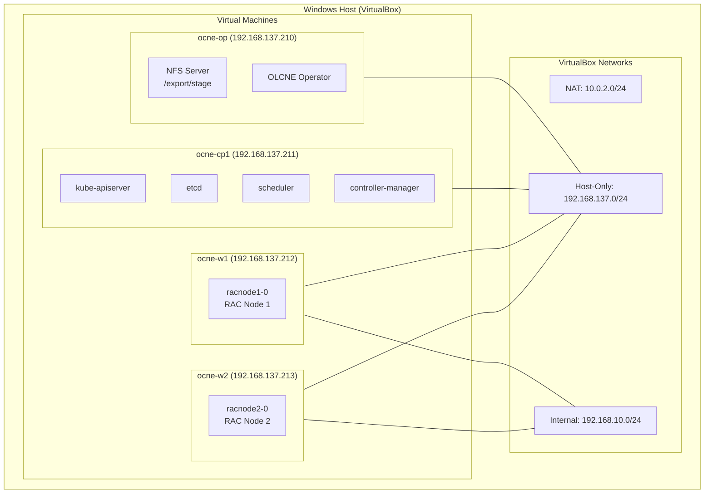

---

## 2. Kubernetes Layer Architecture

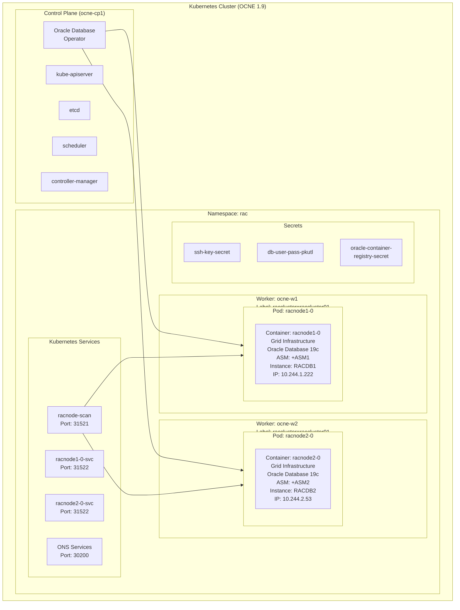

---

## 3. Network Architecture

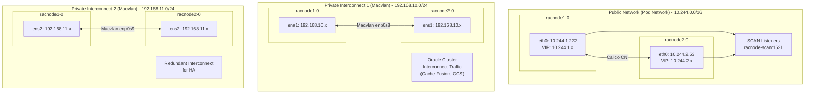

---

## 4. Storage Architecture

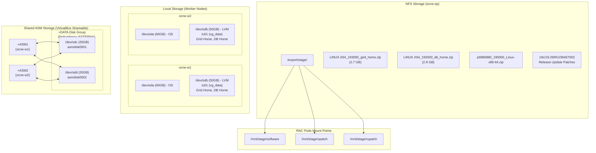

---

## 5. ASM Disk Group Contents

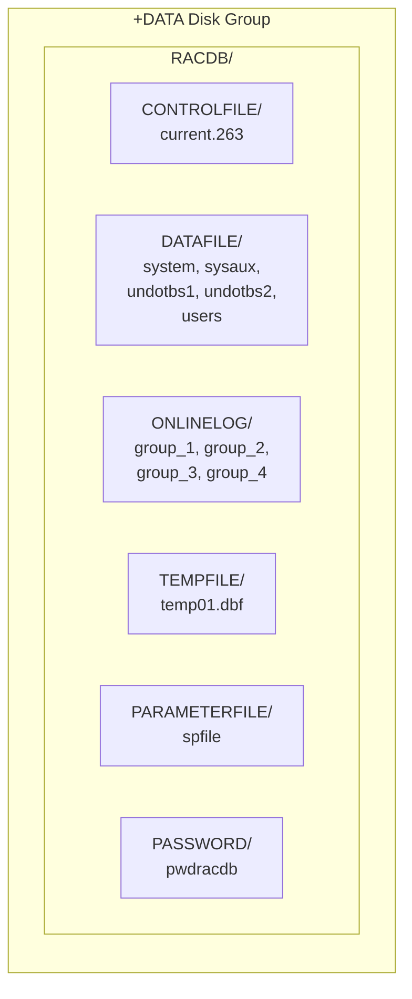

---

## 6. Oracle RAC Component Architecture

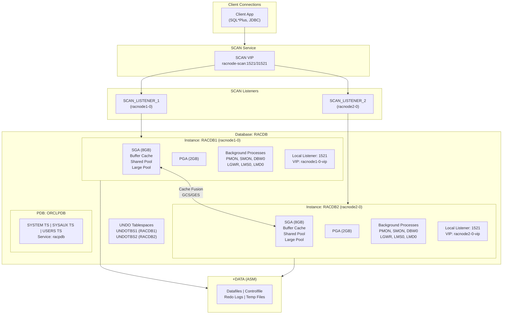

---

## 7. Grid Infrastructure Stack

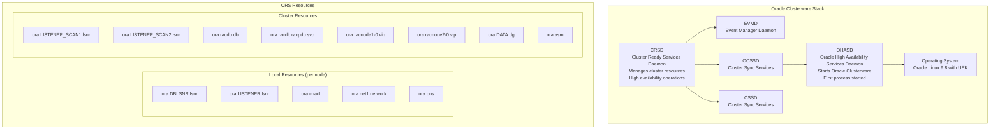

---

## 8. Data Flow Diagram

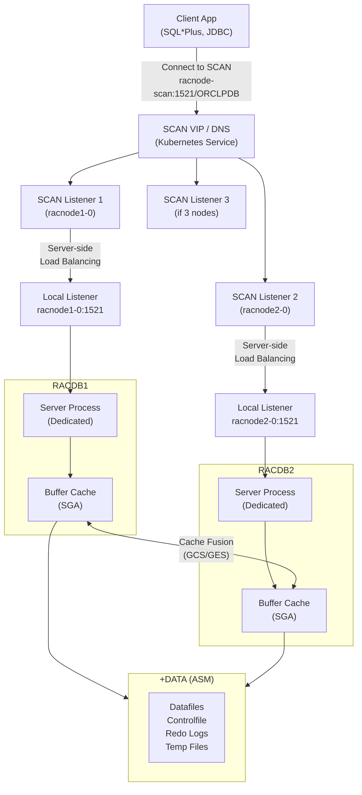

---

## 9. High Availability - Failure Scenarios

### Scenario 1: Instance Failure

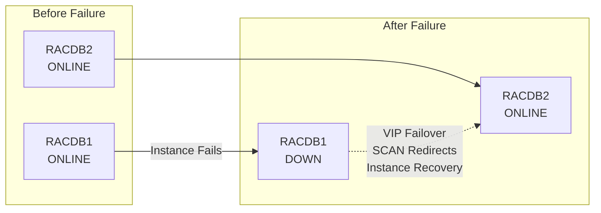

### Scenario 2: Node Failure

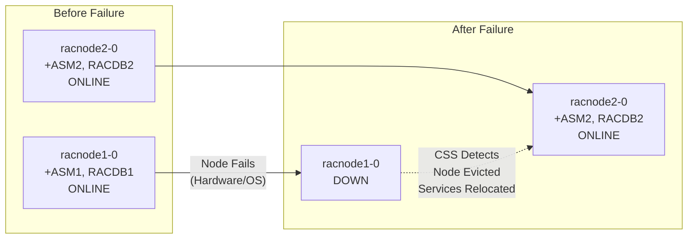

### Scenario 3: Split Brain Prevention

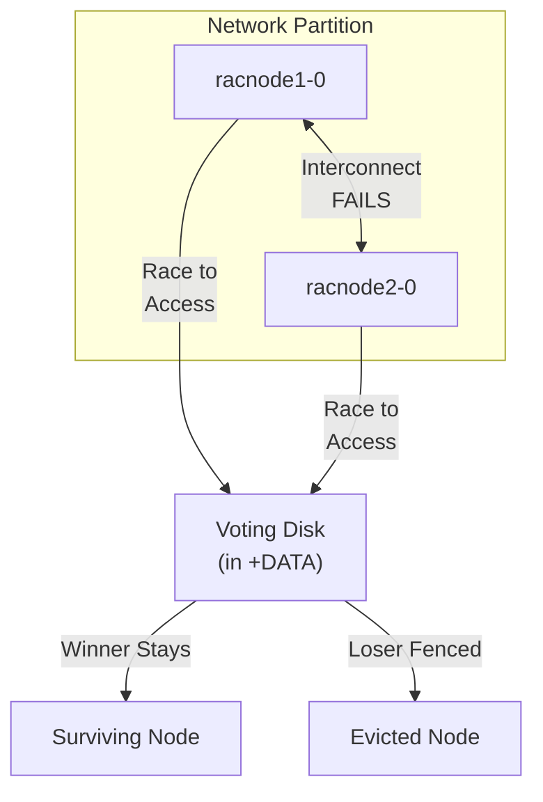

---

## 10. HA Components Summary

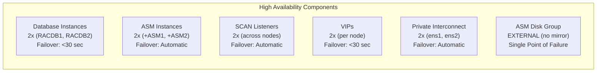

---

## 11. Deployment Flow

```mermaid
flowchart TB
    subgraph Phase1["Phase 1: Pod Creation"]
        Apply["kubectl apply -f racdb.yaml"]
        Operator["Oracle Database Operator"]
        Pods["Create Pods<br/>racnode1-0, racnode2-0<br/>Mount NFS, Attach Macvlan"]

        Apply --> Operator --> Pods
    end

    subgraph Phase2["Phase 2: Grid Infrastructure"]
        Extract1["Extract Software<br/>from NFS"]
        OPatch["Update OPatch"]
        GridSetup["Run gridSetup.sh"]
        ApplyRU["Apply RU Patches"]
        RootSh1["Execute root.sh<br/>(both nodes)"]

        Extract1 --> OPatch --> GridSetup --> ApplyRU --> RootSh1
    end

    subgraph Phase3["Phase 3: Database Software"]
        Extract2["Extract DB Home"]
        RunInst["Run runInstaller<br/>(-noCopy)"]
        OpatchDB["Apply opatchauto"]
        RootSh2["Run root.sh<br/>(DB home)"]

        Extract2 --> RunInst --> OpatchDB --> RootSh2
    end

    subgraph Phase4["Phase 4: Database Creation"]
        CreateDB["Create Database<br/>(RACDB)"]
        StartInst["Start Instances<br/>(RACDB1, RACDB2)"]
        Catalog["Run Catalog Scripts"]
        CreatePDB["Create PDB<br/>(ORCLPDB)"]
        Datapatch["Apply datapatch"]

        CreateDB --> StartInst --> Catalog --> CreatePDB --> Datapatch
    end

    subgraph Phase5["Phase 5: Post-Config"]
        RegSvc["Register Services<br/>with CRS"]
        ConfLsnr["Configure Listeners"]
        StartAll["Start All Services"]
        Complete["DEPLOYMENT<br/>COMPLETE!"]

        RegSvc --> ConfLsnr --> StartAll --> Complete
    end

    Pods --> Extract1
    RootSh1 --> Extract2
    RootSh2 --> CreateDB
    Datapatch --> RegSvc
```

---

## 12. Quick Reference

| Category | Item | Value |
|----------|------|-------|
| **Hostnames** | racnode1-0 | 10.244.1.222 (Pod IP) |
| | racnode2-0 | 10.244.2.53 (Pod IP) |
| | racnode-scan | Kubernetes Service (SCAN) |
| **Ports** | Local Listener (pod) | 1521 |
| | SCAN Listener (NodePort) | 31521 |
| | Local Listener (NodePort) | 31522 |
| | ONS (NodePort) | 30200 |
| **Oracle Homes** | GRID_HOME | /u01/app/19c/grid |
| | GRID_BASE | /u01/app/grid |
| | ORACLE_HOME | /u01/app/oracle/product/19c/dbhome_1 |
| | ORACLE_BASE | /u01/app/oracle |
| **Users** | grid | Grid Infrastructure owner (uid 54321) |
| | oracle | Database owner (uid 54321) |
| **Connect Strings** | CDB | `sqlplus sys/oracle@racnode-scan:1521/RACDB as sysdba` |
| | PDB | `sqlplus sys/oracle@racnode-scan:1521/ORCLPDB as sysdba` |

### Common Commands

```bash
# Check cluster status
crsctl check cluster -all

# Check all CRS resources
crsctl status res -t

# Check database status
srvctl status database -d RACDB

# Check ASM status
srvctl status asm

# List ASM disk groups
asmcmd lsdg

# Check listener status
lsnrctl status
```

---

*Document Version: 2.0 (Mermaid)*
*Created: September 2026*
