# OCNE 1.9 Oracle Database Lab - Architecture Diagrams

## Overall Lab Infrastructure

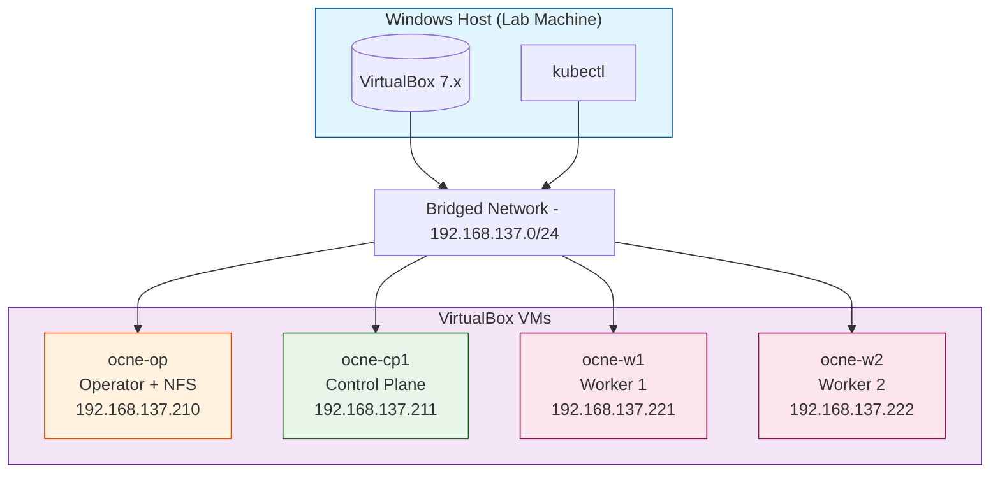

---

## VM Specifications

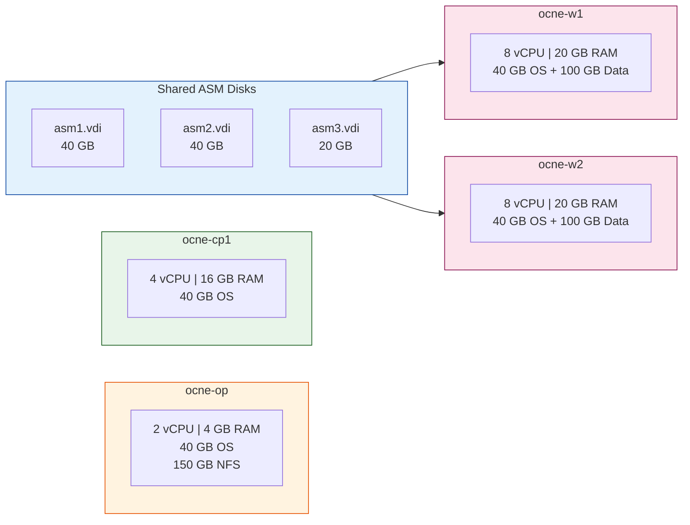

| VM | RAM | CPUs | Storage |
|---|---|---|---|
| ocne-op (.210) | 4 GB | 2 | 40GB OS + NFS export |
| ocne-cp1 (.211) | 16 GB | 4 | 40GB OS |
| ocne-w1 (.221) | 20 GB | 8 | 40GB OS + 100GB Data + ASM disks |
| ocne-w2 (.222) | 20 GB | 8 | 40GB OS + 100GB Data + ASM disks |

---

## Kubernetes Cluster Architecture

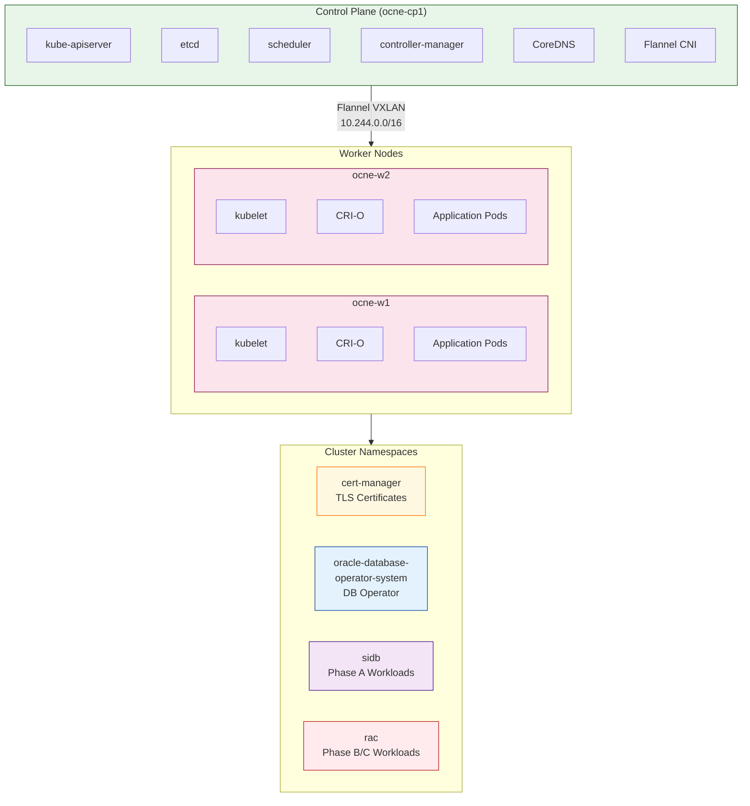

---

## Phase A: SIDB + Data Guard Architecture

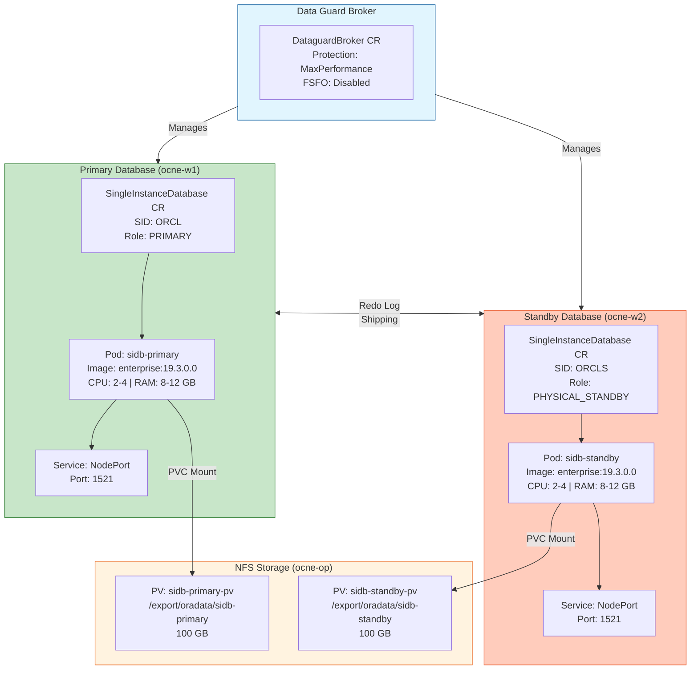

### Data Guard Data Flow

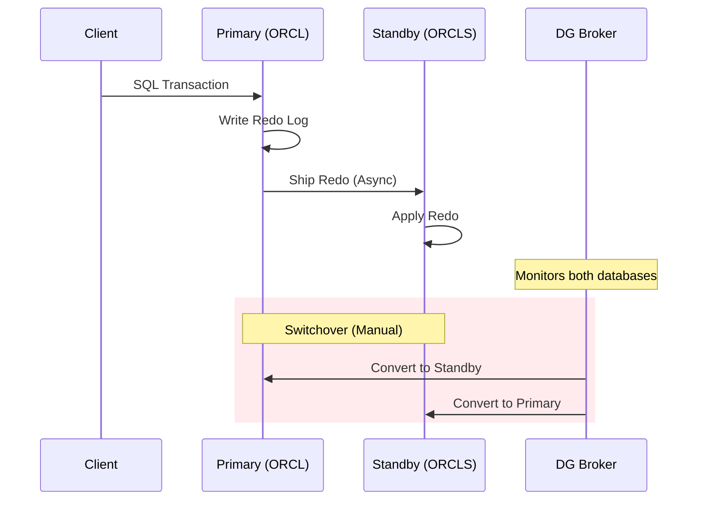

---

## Phase B: Oracle Restart + ASM Architecture

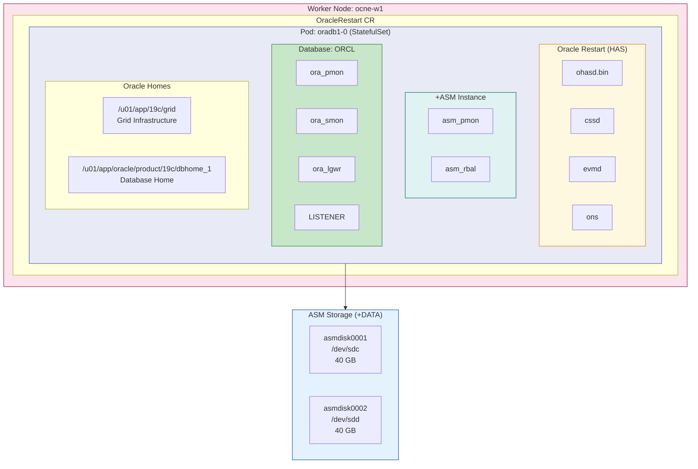

### Oracle Restart Resource Stack

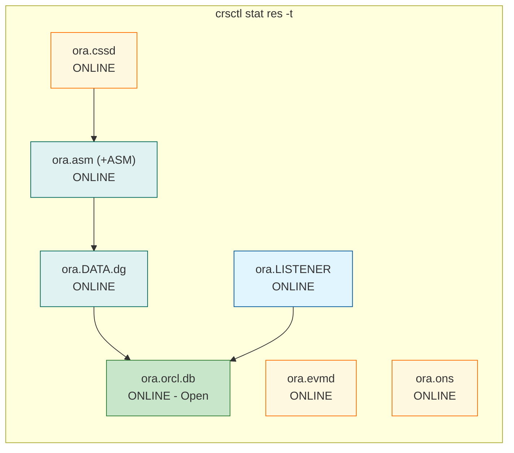

---

## Network Connectivity

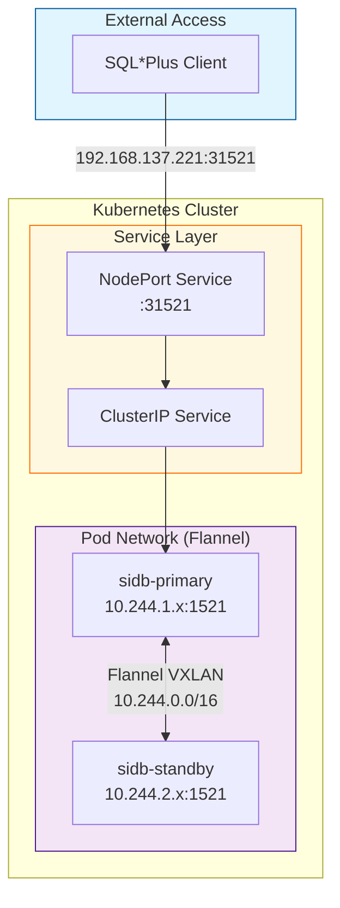

### Connection Strings

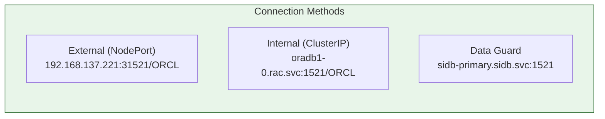

---

## Storage Architecture

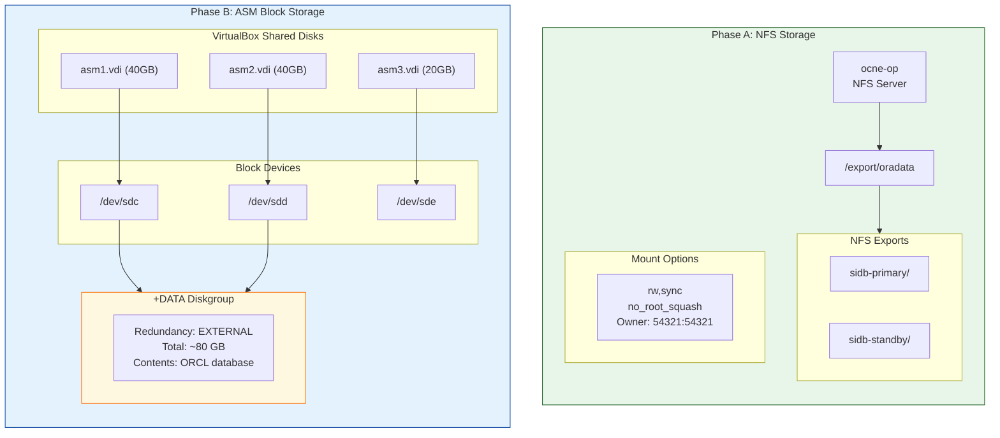

### Storage Comparison

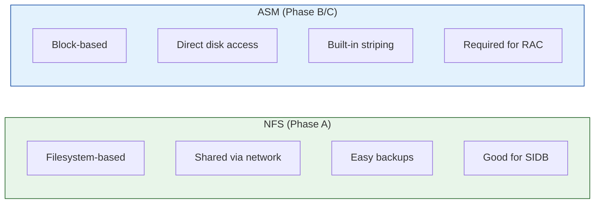

---

## Oracle Database Operator Components

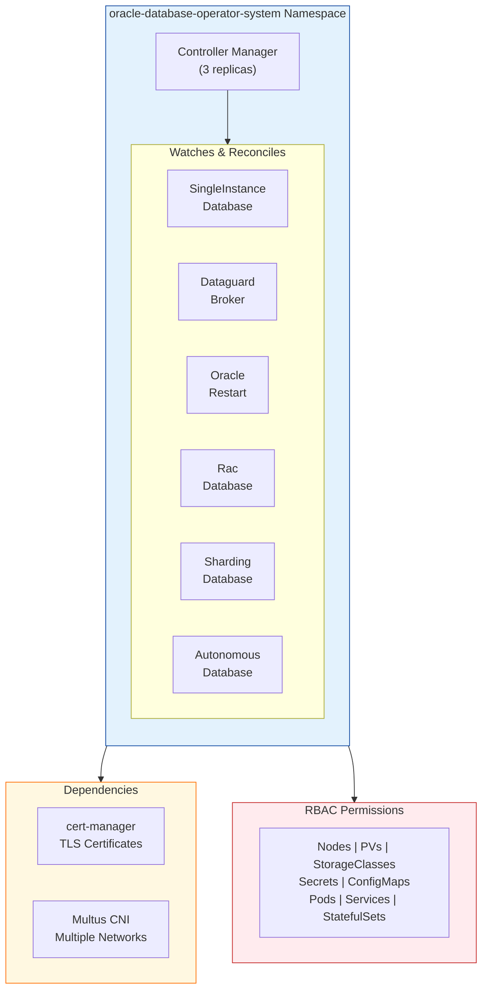

### CRD Lifecycle

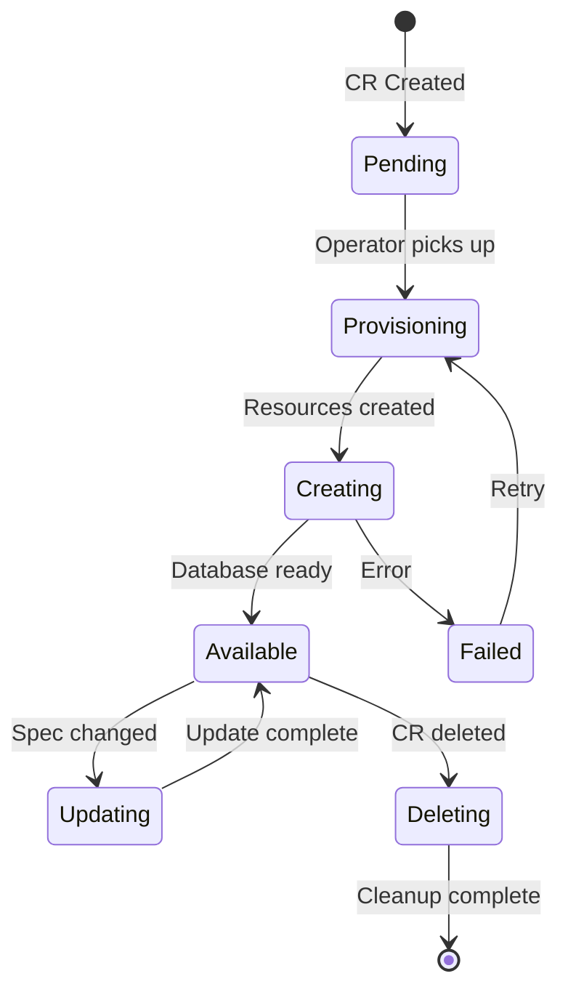

---

## Phase Progression

```mermaid
flowchart LR
    subgraph INFRA["Infrastructure (Phase 0-6)"]
        P0["Phase 0<br/>Windows Prep"]
        P1["Phase 1<br/>Downloads"]
        P2["Phase 2<br/>Golden VM"]
        P3["Phase 3<br/>Clone VMs"]
        P4["Phase 4<br/>Storage"]
        P5["Phase 5<br/>OCNE Install"]
        P6["Phase 6<br/>Operator"]
    end

    subgraph WORKLOADS["Database Workloads"]
        PA["Phase A<br/>SIDB + DG"]
        PB["Phase B<br/>Oracle Restart"]
        PC["Phase C<br/>RAC"]
    end

    P0 --> P1 --> P2 --> P3 --> P4 --> P5 --> P6
    P6 --> PA
    PA --> PB
    PB --> PC

    style P0 fill:#e0e0e0,stroke:#616161
    style P1 fill:#e0e0e0,stroke:#616161
    style P2 fill:#e0e0e0,stroke:#616161
    style P3 fill:#e0e0e0,stroke:#616161
    style P4 fill:#e0e0e0,stroke:#616161
    style P5 fill:#e0e0e0,stroke:#616161
    style P6 fill:#e0e0e0,stroke:#616161
    style PA fill:#c8e6c9,stroke:#2e7d32
    style PB fill:#c8e6c9,stroke:#2e7d32
    style PC fill:#fff8e1,stroke:#ff6f00
```

---

## Summary Table

| Component | Phase A (SIDB+DG) | Phase B (Oracle Restart) | Phase C (RAC) |
|-----------|-------------------|--------------------------|---------------|
| **Namespace** | sidb | rac | rac |
| **CR Type** | SingleInstanceDatabase + DataguardBroker | OracleRestart | RacDatabase |
| **Storage** | NFS (filesystem) | ASM (block devices) | ASM (shared block) |
| **Nodes Used** | ocne-w1 + ocne-w2 | ocne-w1 only | ocne-w1 + ocne-w2 |
| **Database** | 2 instances (primary+standby) | 1 instance (ORCL) | 2 instances (RAC) |
| **HA Mechanism** | Data Guard redo shipping | Oracle Restart auto-restart | RAC + Data Guard |
| **Grid Infra** | None | Yes (19c GI Standalone) | Yes (19c GI Cluster) |
| **ASM** | No | Yes (+DATA diskgroup) | Yes (+DATA, +RECO) |
| **Interconnect** | Flannel (K8s network) | N/A (single node) | Multus macvlan |
| **Status** | Complete | Complete | Planned |
