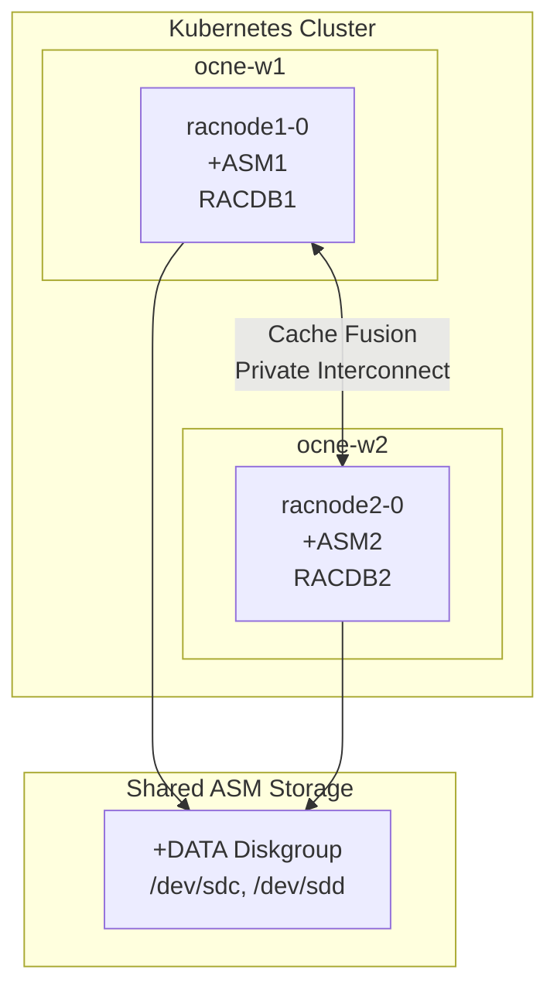

# Phase C: Oracle RAC Setup Guide

This document provides step-by-step instructions to deploy Oracle Real Application Clusters (RAC) on OCNE 1.9 using the Oracle Database Operator.

**Status:** Completed Successfully

---

## Prerequisites Completed

- OCNE 1.9 cluster with Kubernetes 1.29
- Oracle Database Operator v4 installed in `oracle-database-operator-system` namespace
- cert-manager and Multus CNI installed
- Phase A (SIDB + Data Guard) and Phase B (Oracle Restart) completed
- Shared ASM disks attached to workers:
  - `asm1.vdi` (20 GB) → `/dev/sdc`
  - `asm2.vdi` (20 GB) → `/dev/sdd`
- NFS storage configured on ocne-op with Oracle software staged
- Worker nodes labeled for RAC: `raccluster=raccluster01`

---

## Architecture Overview



Oracle RAC provides:
- Grid Infrastructure with Clusterware
- ASM for shared storage management
- Multiple database instances for high availability
- Automatic workload balancing and failover

---

## Phase C1: Network Preparation

### C1.1 Create Macvlan Network Attachment Definitions

RAC requires private interconnect networks for cluster communication. We use Macvlan CNI.

**Enable promiscuous mode on worker host interfaces:**

```bash
# On both ocne-w1 and ocne-w2
ip link set enp0s8 promisc on
ip link set enp0s9 promisc on

# Make persistent via NetworkManager
nmcli connection modify "System enp0s8" 802-3-ethernet.accept-all-mac-addresses yes
nmcli connection modify "System enp0s9" 802-3-ethernet.accept-all-mac-addresses yes
```

**Create NetworkAttachmentDefinitions:**

```bash
# rac-priv1.yaml - First private interconnect
cat <<'EOF' | kubectl apply -f -
apiVersion: "k8s.cni.cncf.io/v1"
kind: NetworkAttachmentDefinition
metadata:
  name: rac-priv1
  namespace: rac
spec:
  config: '{
    "cniVersion": "0.3.1",
    "type": "macvlan",
    "master": "enp0s8",
    "mode": "bridge",
    "ipam": {
      "type": "static"
    }
  }'
EOF

# rac-priv2.yaml - Second private interconnect (redundancy)
cat <<'EOF' | kubectl apply -f -
apiVersion: "k8s.cni.cncf.io/v1"
kind: NetworkAttachmentDefinition
metadata:
  name: rac-priv2
  namespace: rac
spec:
  config: '{
    "cniVersion": "0.3.1",
    "type": "macvlan",
    "master": "enp0s9",
    "mode": "bridge",
    "ipam": {
      "type": "static"
    }
  }'
EOF
```

### C1.2 Label Worker Nodes

```bash
kubectl label node ocne-w1.lab.local raccluster=raccluster01
kubectl label node ocne-w2.lab.local raccluster=raccluster01
```

---

## Phase C2: Storage Preparation

### C2.1 Configure ASM Disks on Workers

The ASM disks must be accessible as raw block devices with proper permissions.

**On both workers:**

```bash
# Create udev rules for ASM disk permissions
cat > /etc/udev/rules.d/99-oracle-asmdevices.rules <<'EOF'
KERNEL=="sdc", OWNER="54321", GROUP="54321", MODE="0660"
KERNEL=="sdd", OWNER="54321", GROUP="54321", MODE="0660"
EOF

# Reload udev
udevadm control --reload-rules
udevadm trigger

# Verify permissions
ls -la /dev/sd[cd]
```

### C2.2 Create ASM Device ConfigMap

```bash
cat <<'EOF' | kubectl apply -f -
apiVersion: v1
kind: ConfigMap
metadata:
  name: asm-device-config
  namespace: rac
data:
  asmdisks: |
    /dev/sdc,ORCL:asmdisk0001
    /dev/sdd,ORCL:asmdisk0002
EOF
```

---

## Phase C3: Secrets and Prerequisites

### C3.1 Create Namespace

```bash
kubectl create namespace rac
```

### C3.2 Create Container Registry Secret

```bash
kubectl create secret docker-registry oracle-container-registry-secret \
  --docker-server=container-registry.oracle.com \
  --docker-username="your-oracle-email" \
  --docker-password="your-password" \
  --namespace=rac
```

### C3.3 Create SSH Key Secret

```bash
# Generate SSH keys
ssh-keygen -t rsa -b 4096 -f /tmp/rac_ssh_key -N ""

# Create secret
kubectl create secret generic ssh-key-secret \
  --from-file=id_rsa=/tmp/rac_ssh_key \
  --from-file=id_rsa.pub=/tmp/rac_ssh_key.pub \
  --from-file=authorized_keys=/tmp/rac_ssh_key.pub \
  --namespace=rac
```

### C3.4 Create Database Password Secret

```bash
kubectl create secret generic db-user-pass-pkutl \
  --from-literal=password='oracle' \
  --namespace=rac
```

---

## Phase C4: Deploy RAC Database

### C4.1 Create RacDatabase Custom Resource

```yaml
# racdb.yaml
apiVersion: database.oracle.com/v4
kind: RacDatabase
metadata:
  name: racdb01
  namespace: rac
spec:
  replicas: 2
  image: container-registry.oracle.com/database/rac_ru:latest-19
  imagePullSecrets:
    - name: oracle-container-registry-secret
  clusterName: raccluster01
  sshKeySecret: ssh-key-secret
  adminPassword:
    secretName: db-user-pass-pkutl
    secretKey: password
  dbName: RACDB
  sid: RACDB
  pdbName: ORCLPDB
  serviceName: racpdb
  characterSet: AL32UTF8

  # Storage Configuration
  storageClass: ""
  persistence:
    size: 50Gi
    storageClass: ""
    accessMode: ReadWriteMany
    volumeMode: Block

  # ASM Configuration
  asmDeviceConfigMap: asm-device-config
  diskGroup:
    name: DATA
    redundancy: EXTERNAL
    disks:
      - /dev/sdc
      - /dev/sdd

  # Network Configuration
  networkAttachmentDefinitions:
    - rac-priv1
    - rac-priv2

  # Node Selection
  nodeSelector:
    raccluster: raccluster01

  # Resource Configuration
  resources:
    requests:
      memory: "16Gi"
      cpu: "4"
    limits:
      memory: "16Gi"
      cpu: "8"

  # Oracle Configuration
  configParams:
    gridHome: "/u01/app/19c/grid"
    dbHome: "/u01/app/oracle/product/19c/dbhome_1"
    gridBase: "/u01/app/grid"
    oracleBase: "/u01/app/oracle"
    stagingLocation: "/scratch/software/stage"
    # NOTE: Omit ruPatchLocation/oPatchLocation when using rac_ru image
    # The rac_ru image already has 19.32 patches pre-applied

  # NFS Mounts for Software Staging
  nfsMounts:
    - name: stage-software
      server: "192.168.137.210"
      path: "/export/stage"
      mountPath: "/scratch/software/stage"
```

### C4.2 Apply the RAC Database

```bash
kubectl apply -f racdb.yaml
```

### C4.3 Monitor Deployment Progress

```bash
# Watch pod creation
kubectl get pods -n rac -w

# Check RAC database status
kubectl get racdatabases -n rac

# View deployment logs
kubectl logs -f racnode1-0 -n rac -c racnode1-0

# Check detailed log inside pod
kubectl exec -it racnode1-0 -n rac -- tail -f /tmp/orod/oracle_db_setup.log
```

**Expected deployment time:** ~2-3 hours

---

## Phase C5: Verification

### C5.1 Check Cluster Status

```bash
kubectl exec racnode1-0 -n rac -- bash -c 'su - grid -c "crsctl check cluster -all"'
```

**Expected output:**
```
**************************************************************
racnode1-0:
CRS-4537: Cluster Ready Services is online
CRS-4529: Cluster Synchronization Services is online
CRS-4533: Event Manager is online
**************************************************************
racnode2-0:
CRS-4537: Cluster Ready Services is online
CRS-4529: Cluster Synchronization Services is online
CRS-4533: Event Manager is online
**************************************************************
```

### C5.2 Check Database Status

```bash
kubectl exec racnode1-0 -n rac -- bash -c 'su - grid -c "srvctl status database -d RACDB -v"'
```

**Expected output:**
```
Instance RACDB1 is running on node racnode1-0 with online services racpdb. Instance status: Open.
Instance RACDB2 is running on node racnode2-0 with online services racpdb. Instance status: Open.
```

### C5.3 Check ASM Status

```bash
kubectl exec racnode1-0 -n rac -- bash -c 'su - grid -c "srvctl status asm"'
```

**Expected output:**
```
ASM is running on racnode1-0,racnode2-0
```

### C5.4 Check All CRS Resources

```bash
kubectl exec racnode1-0 -n rac -- bash -c 'su - grid -c "crsctl stat res -t"'
```

### C5.5 Connect to Database

```bash
# Connect to CDB
kubectl exec -it racnode1-0 -n rac -- bash -c 'su - oracle -c "sqlplus / as sysdba"'

# Verify RAC
SQL> SELECT inst_id, instance_name, host_name, status FROM gv\$instance;

# Check PDB
SQL> SELECT con_id, name, open_mode FROM v\$pdbs;
```

---

## Phase C6: Post-Deployment Configuration

### C6.1 Verify Services

```bash
kubectl exec racnode1-0 -n rac -- bash -c 'su - grid -c "srvctl status service -d RACDB"'
```

### C6.2 Test Connectivity via SCAN

```bash
# From any pod or node with Oracle client
sqlplus sys/oracle@racnode-scan:1521/ORCLPDB as sysdba
```

### C6.3 Check Kubernetes Services

```bash
kubectl get svc -n rac
```

**Expected services:**
- `racnode-scan` - SCAN service (NodePort 31521)
- `racnode1-0-svc` - Node 1 service
- `racnode2-0-svc` - Node 2 service

---

## Troubleshooting

### Common Issues

**1. Pods stuck in Init state**
```bash
# Check init container logs
kubectl logs racnode1-0 -n rac -c racnode1-init1
```

**2. ASM disk discovery issues**
```bash
# Verify disk permissions inside pod
kubectl exec racnode1-0 -n rac -- ls -la /dev/sd*

# Check ASM device config
kubectl exec racnode1-0 -n rac -- cat /etc/orod/asm_device_list
```

**3. Private interconnect issues**
```bash
# Verify macvlan interfaces
kubectl exec racnode1-0 -n rac -- ip addr show

# Check promiscuous mode on host
ip link show enp0s8
```

**4. Grid setup failures**
```bash
# Check Grid setup log
kubectl exec racnode1-0 -n rac -- cat /u01/app/oraInventory/logs/GridSetupActions*/gridSetupActions*.log
```

### Useful Log Locations

| Log | Path |
|-----|------|
| Main deployment log | `/tmp/orod/oracle_db_setup.log` |
| Grid setup log | `/u01/app/oraInventory/logs/GridSetupActions*/*.log` |
| CRS alert log | `/u01/app/grid/diag/crs/*/crs/trace/alert*.log` |
| ASM alert log | `/u01/app/grid/diag/asm/+asm/+ASM*/trace/alert*.log` |
| Database alert log | `/u01/app/oracle/diag/rdbms/racdb/RACDB*/trace/alert*.log` |

---

## Key Learnings

### Image Selection

| Image | Description | Use Case |
|-------|-------------|----------|
| `rac_ru:latest-19` | Pre-patched with 19.32 RU | Production (recommended) |
| `rac:latest` | Base 19.3.0 | When custom patching needed |
| `rac-slim:*` | Minimal image | Resource-constrained environments |

**Important:** When using `rac_ru` image, do NOT specify `ruPatchLocation` or `oPatchLocation` in configParams - the image already has patches applied. Specifying these causes redundant patching operations that add hours to deployment.

### Optimized Configuration for Pre-Patched Image

```yaml
configParams:
  gridHome: "/u01/app/19c/grid"
  dbHome: "/u01/app/oracle/product/19c/dbhome_1"
  gridBase: "/u01/app/grid"
  oracleBase: "/u01/app/oracle"
  stagingLocation: "/scratch/software/stage"
  # OMIT these when using rac_ru image:
  # ruPatchLocation: "/scratch/software/stage/19c/19.29/RU"
  # oPatchLocation: "/scratch/software/stage/19c/19.29/OPATCH"
```

---

## Related Documentation

- [RAC Architecture Diagrams](../rac/architecture.md) - Mermaid diagrams
- [RAC Networking Guide](../rac/networking.md) - Detailed network configuration
- [RAC Operations Guide](../rac/operations.md) - srvctl/crsctl commands
- [RAC Image Guide](../rac/images.md) - Container image details
- [RAC Deployment Proof](../rac/deployment-proof.md) - Verification outputs

---

*Document Version: 1.0*
*Completed: September 2026*
