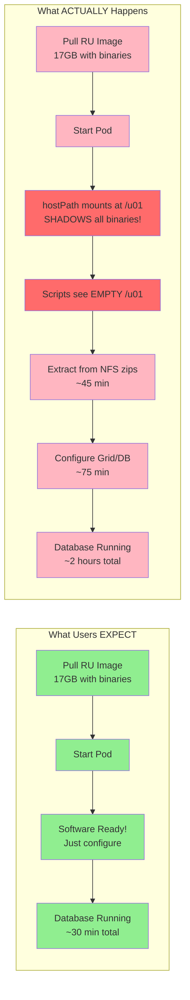
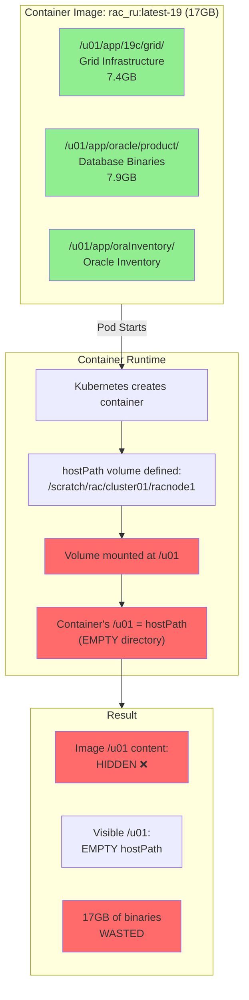
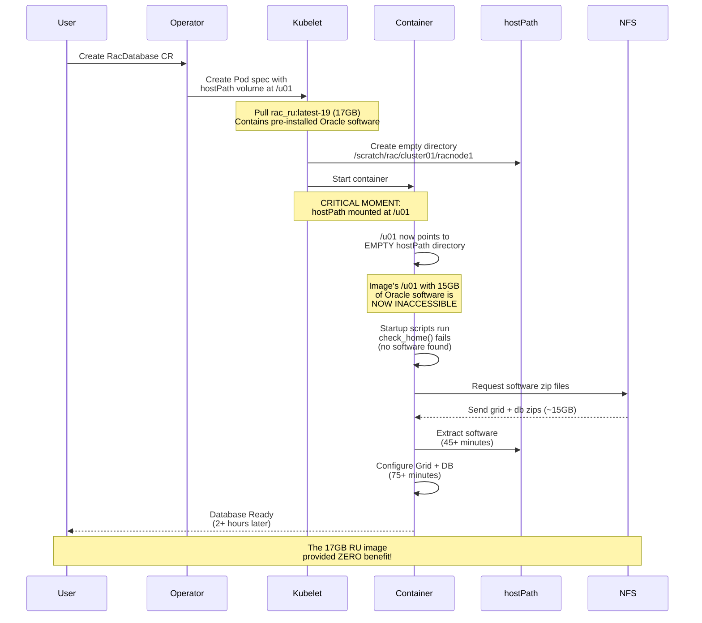
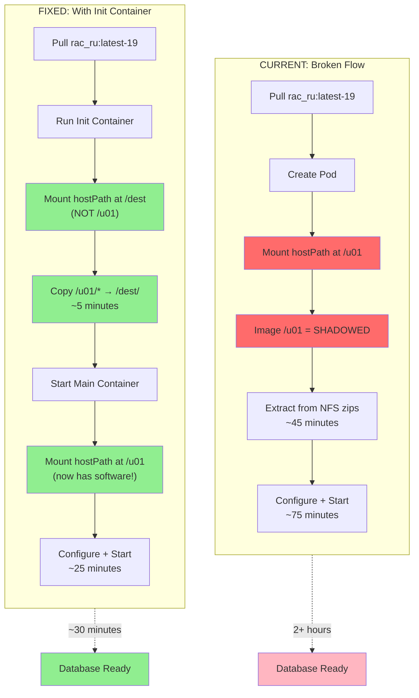
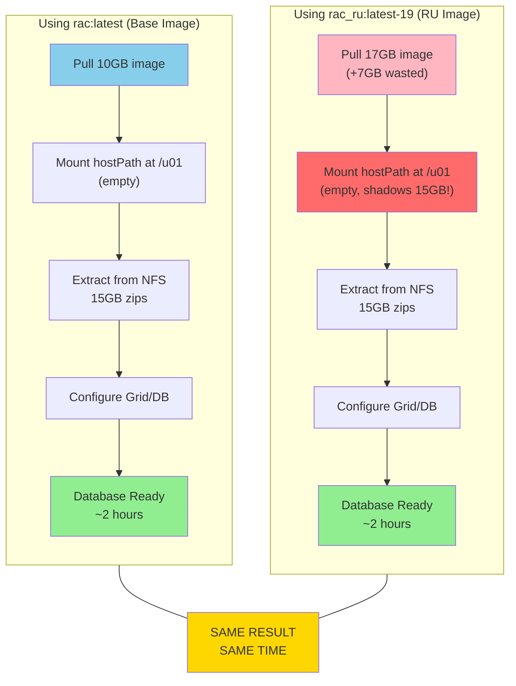
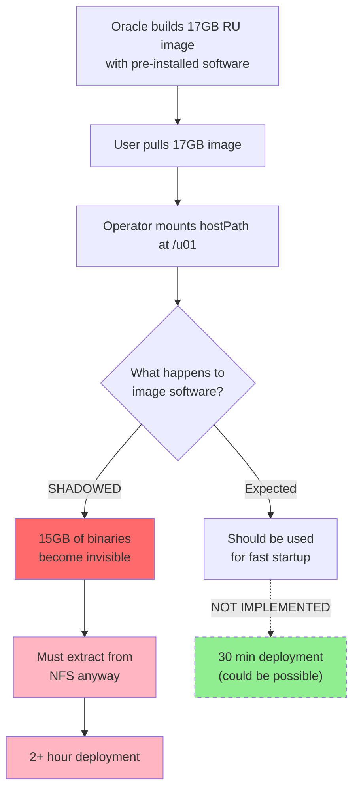

# Oracle Database Operator: Design Limitations and Recommendations

This document analyzes a significant design limitation in the Oracle Database Operator for Kubernetes regarding pre-built Release Update (RU) images, and proposes solutions for Oracle to consider.

---

## Executive Summary

Oracle provides pre-built RAC container images with Release Updates pre-applied (`rac_ru:latest-19`), but **the Oracle Database Operator never uses this pre-installed software**. The operator's hostPath volume architecture shadows the container's `/u01` directory, making the 17GB of pre-installed binaries completely inaccessible. Users must still stage software zip files on NFS and wait for extraction, negating the primary benefit of pre-built images.

---

## Visual Overview

### What Users Expect vs Reality



### The hostPath Shadow Problem



---

## The Problem

### What Oracle Provides

Oracle Container Registry offers two RAC image types:

| Image | Size | Contents |
|-------|------|----------|
| `rac:latest` | ~10GB | Base OS + scripts (no Oracle binaries) |
| `rac_ru:latest-19` | ~17GB | Base OS + scripts + **pre-installed Grid 19c + DB 19c with RU patches** |

The `rac_ru` image contains fully installed and patched Oracle software:
```
/u01/app/19c/grid/           # Grid Infrastructure 19.23 (7.4GB)
/u01/app/oracle/product/     # Database 19.23 (7.9GB)
/u01/app/oraInventory/       # Oracle Inventory
```

### What the Operator Does

The Oracle Database Operator creates pods with hostPath volumes:

```yaml
volumes:
- name: software-vol
  hostPath:
    path: /scratch/rac/cluster01/racnode1   # Empty directory on host

volumeMounts:
- name: software-vol
  mountPath: /u01                            # Shadows container's /u01!
```

**Result**: The moment the pod starts, Kubernetes mounts the empty hostPath at `/u01`, completely hiding the container's pre-installed software.

```
┌─────────────────────────────────────────────────────────────┐
│  Container: rac_ru:latest-19                                │
│                                                             │
│  Image layer:  /u01/app/19c/grid/  (7.4GB) ─┐              │
│                /u01/app/oracle/    (7.9GB)  │ INACCESSIBLE │
│                                             │ (shadowed)    │
│  Mounted:      /u01 → hostPath (empty) ─────┘              │
│                                                             │
│  Scripts see empty /u01, must extract from zip files       │
└─────────────────────────────────────────────────────────────┘
```

### The Waste

| Resource | With Base Image | With RU Image | Difference |
|----------|-----------------|---------------|------------|
| Image pull | 10GB | 17GB | +7GB wasted bandwidth |
| Registry storage | 10GB | 17GB | +7GB wasted storage |
| Extraction needed? | Yes | **Yes** | No benefit |
| Total deploy time | ~2 hours | ~2 hours | No improvement |

**Users pay the cost of the larger image but receive zero benefit.**

### Complete Pod Lifecycle: Where It Goes Wrong



---

## Why This Happens

### Operator's Persistence Model

The operator uses hostPath for legitimate reasons:

1. **Persistence across pod restarts** - Oracle software survives container recreation
2. **In-place patching** - Apply patches without rebuilding images
3. **Traditional deployment pattern** - Mimics bare-metal Oracle installations

### The Oversight

The operator was designed assuming software comes from:
- Staged zip files on NFS (`hostSwStageLocation`)
- Previous deployment (hostPath already populated)

**No code path exists to copy from the container image to hostPath.**

### Script Analysis Evidence

From `/opt/scripts/startup/scripts/orasetupenv.py`:

```python
def _setup_software(self, ...):
    # Only checks for staged zip files
    if not (self.ocommon.check_key("STAGING_SOFTWARE_LOC", self.ora_env_dict) and
            self.ocommon.check_key(sw_zip_key, self.ora_env_dict)):
        return  # No staged software, exit

    swfile = self.ora_env_dict["STAGING_SOFTWARE_LOC"] + "/" + self.ora_env_dict[sw_zip_key]
    if os.path.isfile(swfile):
        # Extract from zip to hostPath
        cmd = 'su - {0} -c "unzip -q {1} -d {2}"'.format(user, swfile, home)
        ...
```

The code **never checks if software already exists in the container's filesystem**.

---

## Recommendations for Oracle

### Proposed Fix: Init Container Pre-Copy



### Option 1: Init Container Pre-Copy (Recommended)

Add an init container that copies software from image to hostPath before the main container starts:

```yaml
initContainers:
- name: copy-software
  image: rac_ru:latest-19
  command:
  - /bin/bash
  - -c
  - |
    if [ ! -f /dest/app/19c/grid/bin/oracle ]; then
      echo "Copying software from image to hostPath..."
      cp -a /u01/* /dest/
    else
      echo "Software already exists, skipping copy"
    fi
  volumeMounts:
  - name: software-vol
    mountPath: /dest           # Mount hostPath at different path
  # Note: /u01 remains unmounted, accessible from image layer
```

**Benefits:**
- No changes to startup scripts needed
- Backward compatible (works with or without RU images)
- Users immediately benefit from pre-built images

### Option 2: Overlay Filesystem

Use overlayfs to layer hostPath on top of container filesystem:

```yaml
volumes:
- name: software-overlay
  emptyDir: {}

# In container
command:
- /bin/bash
- -c
- |
  mount -t overlay overlay \
    -o lowerdir=/u01,upperdir=/overlay/upper,workdir=/overlay/work \
    /u01
  exec /opt/scripts/startup/main.py
```

**Benefits:**
- Container's /u01 becomes the read-only lower layer
- Changes go to overlay (upperdir)
- Instant startup with pre-built images

**Challenges:**
- Requires privileged container
- More complex debugging

### Option 3: Conditional hostPath Mount

Modify the operator to conditionally mount hostPath:

```yaml
# New CRD field
spec:
  usePrebuiltImage: true  # Skip hostPath for /u01

# Operator logic
if spec.usePrebuiltImage:
    # Mount hostPath only for /u01/app/oracle/oradata (data files)
    # Leave /u01/app/19c/grid and /u01/app/oracle/product from image
else:
    # Current behavior - full hostPath mount
```

**Benefits:**
- User choice
- Maintains backward compatibility

**Challenges:**
- Requires CRD changes
- Patching/upgrades become more complex

### Option 4: Script Enhancement

Modify startup scripts to detect and use container software:

```python
def _setup_software(self, ...):
    # NEW: Check if software exists in container image
    if os.path.isfile(f"{home}/bin/oracle"):
        self.log_info_message("Software found in container image")
        if not os.path.isfile(f"{hostpath_home}/bin/oracle"):
            self.log_info_message("Copying from container to hostPath...")
            shutil.copytree(home, hostpath_home)
        return

    # Existing logic: extract from staged zip
    ...
```

---

## Current Workarounds for Users

Until Oracle addresses this, users can:

### 1. Use Base Image (Save Bandwidth)

Since RU image provides no benefit, use the smaller base image:

```yaml
image: container-registry.oracle.com/database/rac:latest
# Instead of: rac_ru:latest-19
```

Stage software zips on NFS as documented.

### 2. Preserve hostPath Between Deployments

After first successful deployment:
- Don't clean `/scratch/rac/cluster01/` directories
- Subsequent deployments detect existing software and skip extraction

```bash
# Round N completes successfully
# hostPath now contains configured software

# Round N+1
# Scripts detect existing installation → skip extraction (~5 min vs ~2 hours)
```

### 3. Manual Pre-Population

Before deploying, manually copy software to hostPath:

```bash
# On worker node
docker create --name temp rac_ru:latest-19
docker cp temp:/u01/. /scratch/rac/cluster01/racnode1/
docker rm temp

# Also need to create /etc/oracle structure
# (Complex - not recommended)
```

**Note**: This won't fully skip configuration because `/etc/oracle` and `cluvfy` are created during Grid configuration, not present in the image.

---

## Impact Assessment

### Current State

| Metric | Impact |
|--------|--------|
| Wasted bandwidth per deployment | 7GB × number of nodes |
| Wasted registry storage | 7GB per RU image version |
| User confusion | High (expects pre-built to be faster) |
| Documentation accuracy | Misleading (implies RU images save time) |

### After Fix (Option 1)

| Metric | Improvement |
|--------|-------------|
| Fresh deployment time | ~2 hours → ~30 minutes |
| Bandwidth per deployment | 17GB once (cached) vs 17GB + extraction |
| User experience | Matches expectations |

---

## Conclusion

### Base Image vs RU Image: No Practical Difference



### Summary: The Flaw at a Glance



The Oracle Database Operator's hostPath architecture, while serving legitimate persistence needs, inadvertently nullifies the value of pre-built RU images. This represents:

1. **Wasted resources** - Users download 7GB extra for no benefit
2. **Missed opportunity** - Pre-built images could dramatically speed deployment
3. **User confusion** - Documentation implies RU images are faster

**Recommended Fix**: Implement Option 1 (init container pre-copy) as it requires minimal changes, maintains backward compatibility, and immediately delivers the expected benefits of pre-built images.

---

## References

- Oracle Database Operator GitHub: https://github.com/oracle/oracle-database-operator
- Container Registry: https://container-registry.oracle.com/
- Startup script analysis: See `container-script-extraction.md` in this repository

---

*Document Version: 1.0*
*Created: September 2026*
*Based on: Oracle Database Operator v1.2.0, RAC image rac_ru:latest-19 (19.23)*
