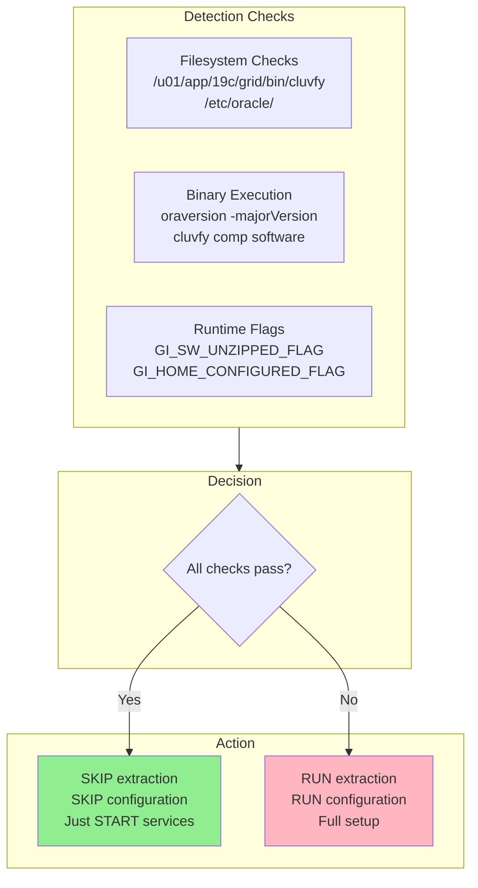
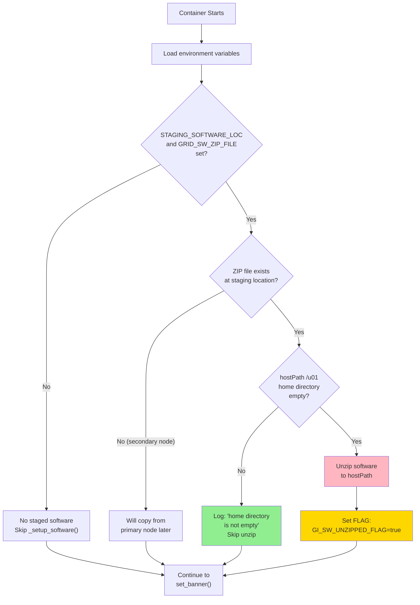
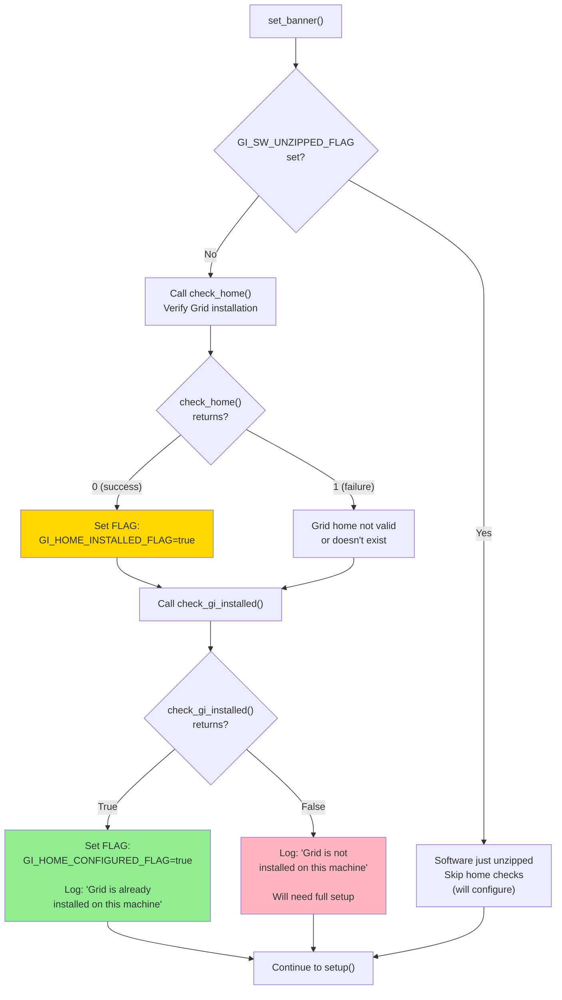
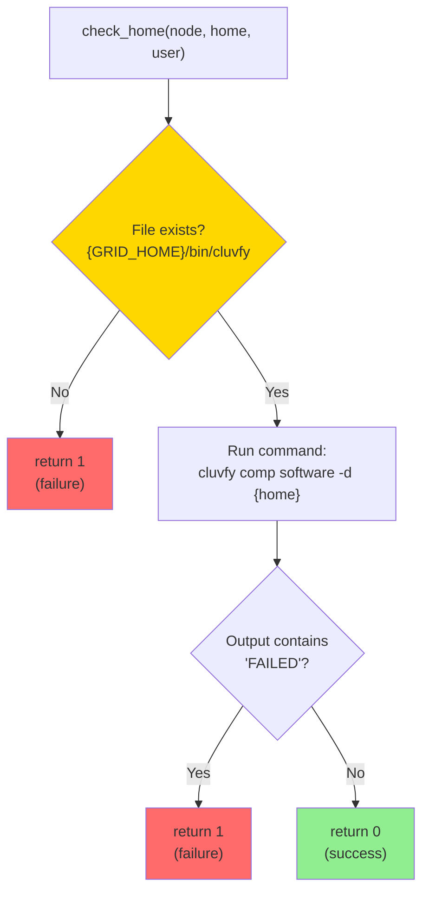
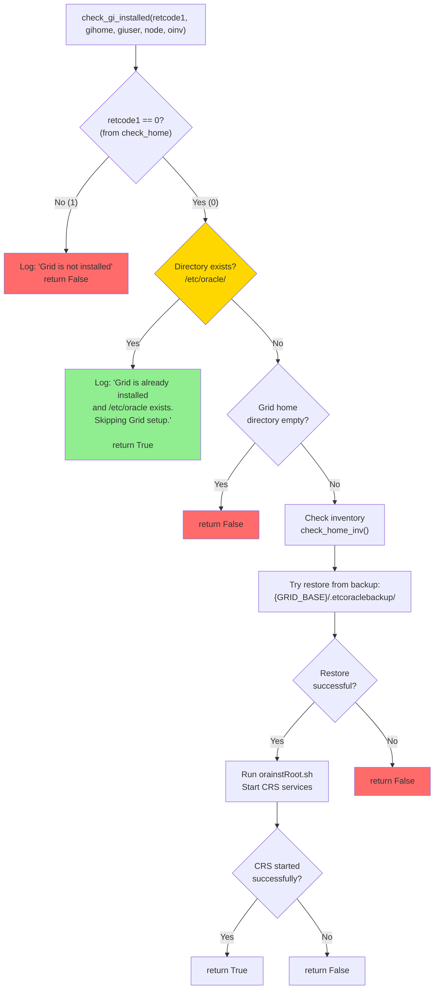
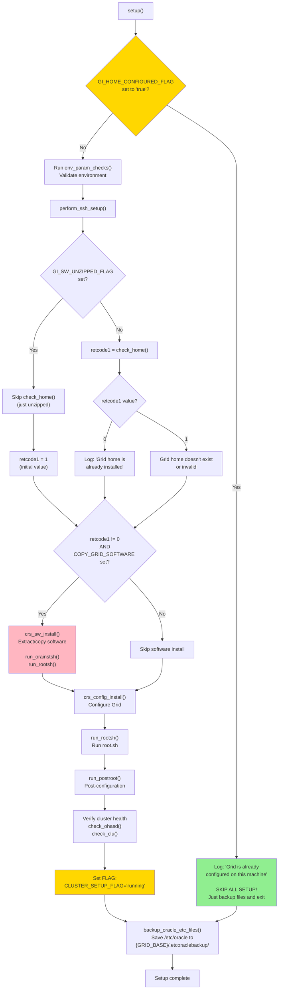
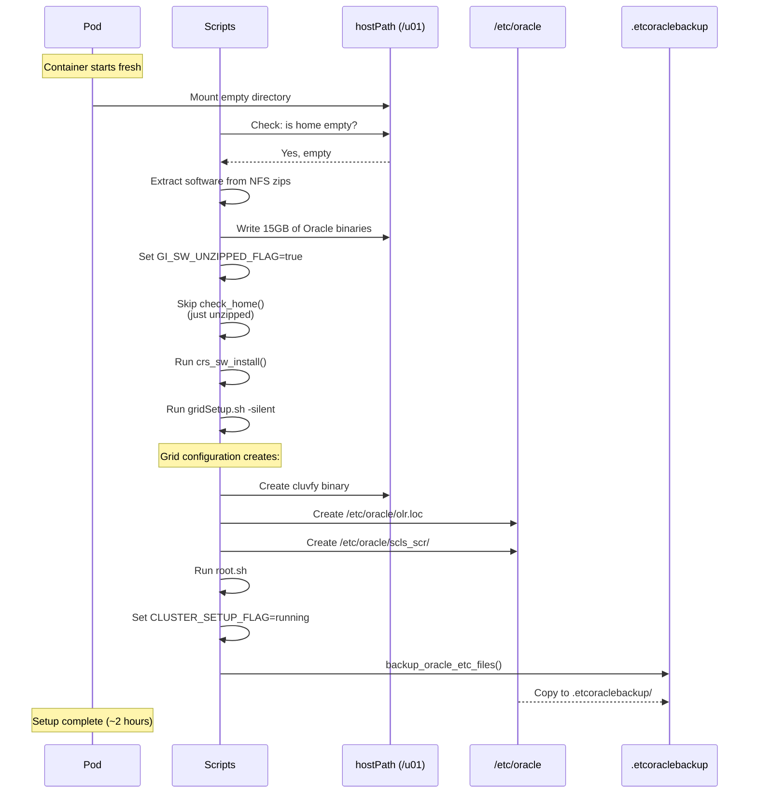
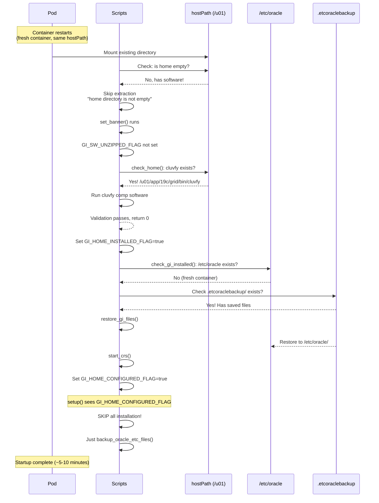
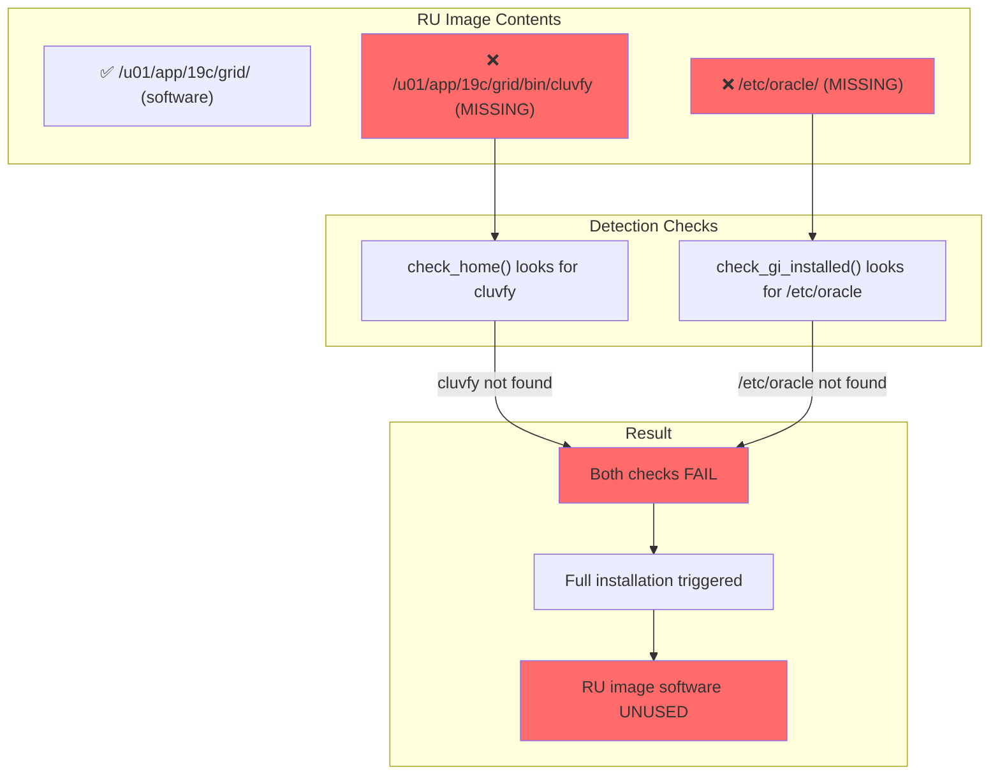

# Oracle RAC Operator: Software Detection and Configuration Workflow

This document details exactly how the Oracle Database Operator detects existing software installations and avoids redundant extraction/configuration on subsequent pod restarts.

---

## Overview

The operator uses a combination of:
1. **Filesystem checks** - Does the software exist on disk?
2. **Binary execution** - Can Oracle tools run successfully?
3. **Runtime flags** - Environment variables set during execution



---

## Runtime Flags (Environment Variables)

These flags are set in the `ora_env_dict` dictionary during script execution:

| Flag | Set When | Purpose |
|------|----------|---------|
| `GI_SW_UNZIPPED_FLAG` | Software zip extracted to hostPath | Skip `check_home()` call |
| `GI_HOME_INSTALLED_FLAG` | `check_home()` returns 0 | Indicates binaries exist |
| `GI_HOME_CONFIGURED_FLAG` | `check_gi_installed()` returns True | Skip ALL Grid setup |
| `RAC_SW_UNZIPPED_FLAG` | DB software zip extracted | Skip DB home check |
| `COPY_GRID_SOFTWARE` | Staging location has zip files | Triggers extraction |
| `CLUSTER_SETUP_FLAG` | Grid configuration completes | Cluster is running |

---

## Detailed Detection Flow

### Phase 1: Environment Setup (orasetupenv.py)



**Key Code** (`orasetupenv.py:545`):
```python
def _setup_software(self, sw_zip_key, copy_key, params_getter, unzip_flag_key, ...):
    # Check if staging location and zip file are configured
    if not (self.ocommon.check_key("STAGING_SOFTWARE_LOC", self.ora_env_dict) and
            self.ocommon.check_key(sw_zip_key, self.ora_env_dict)):
        return  # No staged software configured

    swfile = self.ora_env_dict["STAGING_SOFTWARE_LOC"] + "/" + self.ora_env_dict[sw_zip_key]

    if os.path.isfile(swfile):
        home_files = os.listdir(home)
        if len(home_files) == 0:
            # Home is empty, extract software
            cmd = 'su - {0} -c "unzip -q {1} -d {2}"'.format(user, swfile, home)
            # ... execute unzip ...

            # SET FLAG: Software was just unzipped
            self.ora_env_dict = self.ocommon.add_key(unzip_flag_key, "true", self.ora_env_dict)
        else:
            # Home not empty, skip extraction
            self.ocommon.log_error_message("oracle gi home directory is not empty. skipping software unzipping...")
```

---

### Phase 2: Banner Check (orasetupenv.py)

This phase determines if Grid is already fully configured.



**Key Code** (`orasetupenv.py:904`):
```python
def set_banner(self):
    if self.ocommon.check_key("OP_TYPE", self.ora_env_dict):
        # If software was just unzipped, skip the home checks
        if self.ocommon.check_key("GI_SW_UNZIPPED_FLAG", self.ora_env_dict):
            msg = "Since OP_TYPE is set, setup will be initiated..."
            return

        # Check if Grid home exists and is valid
        retcode1 = self.ocvu.check_home(pubhostname, gihome, giuser)

        if retcode1 == 0:
            # Grid home is valid, set installed flag
            self.ora_env_dict = self.ocommon.add_key("GI_HOME_INSTALLED_FLAG", "true", self.ora_env_dict)

        # Check if Grid is fully configured
        status = self.ocommon.check_gi_installed(retcode1, gihome, giuser, pubhostname, invloc)

        if status:
            # Grid is fully configured!
            self.ora_env_dict = self.ocommon.add_key("GI_HOME_CONFIGURED_FLAG", "true", self.ora_env_dict)
```

---

### Phase 3: check_home() - Binary Validation (oracvu.py)

This function validates that Grid software exists and is functional.



**Key Code** (`oracvu.py:217`):
```python
def check_home(self, node, home, user):
    """Check if CRS software is configured properly."""
    giuser, gihome, gbase, oinv = self.ocommon.get_gi_params()

    # CHECK 1: Does cluvfy binary exist?
    cvufile = '{0}/bin/cluvfy'.format(gihome)
    if not self.ocommon.check_file(cvufile, True, None, None):
        return 1  # cluvfy doesn't exist = software not installed

    # CHECK 2: Run cluvfy to validate software installation
    cmd = '''su - {0} -c "{1}/bin/cluvfy comp software -d {2} -verbose"'''.format(user, gihome, home)
    output, error, retcode = self.ocommon.execute_cmd(cmd, None, None)

    if not self.ocommon.check_substr_match(output, "FAILED"):
        return 0  # No failures = software is valid
    else:
        return 1  # Validation failed
```

**Important**: `cluvfy` binary is created during Grid **configuration**, not during extraction. This is why pre-copying from the RU image doesn't skip installation - `cluvfy` doesn't exist in the image!

---

### Phase 4: check_gi_installed() - Configuration Validation (oracommon.py)

This function checks if Grid is fully configured (not just extracted).



**Key Code** (`oracommon.py:1933`):
```python
def check_gi_installed(self, retcode1, gihome, giuser, node, oinv):
    """Check if Grid is fully installed and configured."""

    if retcode1 == 0:  # check_home() passed
        # CHECK: Does /etc/oracle directory exist?
        if os.path.isdir("/etc/oracle"):
            # FULLY CONFIGURED - Skip everything!
            bstr = "Grid is already installed on this machine and /etc/oracle also exist. Skipping Grid setup.."
            self.log_info_message(self.print_banner(bstr), self.file_name)
            return True
        else:
            # Software exists but /etc/oracle missing
            # Try to restore from backup
            dir = os.listdir(gihome)
            if len(dir) != 0:
                status = self.check_home_inv(None, gihome, giuser)
                if status:
                    # Restore /etc/oracle from backup
                    status = self.restore_gi_files(gihome, giuser)
                    if status:
                        self.run_orainstsh_local(giuser, node, oinv)
                        status = self.start_crs(gihome, giuser)
                        return status
            return False
    else:
        # check_home() failed - Grid not installed
        self.log_info_message("Grid is not installed on this machine. Proceeding further...", self.file_name)
        return False
```

---

### Phase 5: setup() - Main Installation Logic (oragiprov.py)

This is where the decision to install or skip is made.



**Key Code** (`oragiprov.py:90`):
```python
def setup(self):
    """This function sets up Grid on this machine."""

    giuser, gihome, obase, invloc = self.ocommon.get_gi_params()
    pubhostname = self.ocommon.get_public_hostname()
    retcode1 = 1  # Default: assume Grid not installed

    # DECISION POINT 1: Was software just unzipped?
    if not self.ocommon.check_key("GI_SW_UNZIPPED_FLAG", self.ora_env_dict):
        # No, check if Grid home exists
        retcode1 = self.ocvu.check_home(pubhostname, gihome, giuser)

    if retcode1 == 0:
        bstr = "Grid home is already installed on this machine"
        self.ocommon.log_info_message(self.ocommon.print_banner(bstr), self.file_name)

    # DECISION POINT 2: Is Grid already configured?
    if self.ocommon.check_key("GI_HOME_CONFIGURED_FLAG", self.ora_env_dict):
        bstr = "Grid is already configured on this machine"
        self.ocommon.log_info_message(self.ocommon.print_banner(bstr), self.file_name)
        # SKIP EVERYTHING - just backup and exit
    else:
        # Full setup required
        self.env_param_checks()
        self.perform_ssh_setup()

        # DECISION POINT 3: Need to install software?
        if retcode1 != 0 and self.ocommon.check_key("COPY_GRID_SOFTWARE", self.ora_env_dict):
            self.crs_sw_install()  # Extract/copy software
            self.run_orainstsh()
            self.run_rootsh()

        # Configure Grid
        gridrsp = self.crs_config_install()
        self.run_rootsh()
        self.run_postroot(gridrsp)

        # Verify and set running flag
        self.ora_env_dict = self.ocommon.add_key("CLUSTER_SETUP_FLAG", "running", self.ora_env_dict)

    # Always backup /etc/oracle for next restart
    self.backup_oracle_etc_files()
```

---

## Complete Lifecycle: Fresh Install vs Pod Restart

### Fresh Installation (First Time)



### Pod Restart (Subsequent Times)



---

## Summary: What Gets Checked and Set

### Filesystem Checks

| Check | Location | Created During | Required For |
|-------|----------|----------------|--------------|
| cluvfy binary | `{GRID_HOME}/bin/cluvfy` | Grid Configuration | `check_home()` to pass |
| /etc/oracle dir | `/etc/oracle/` | Grid Configuration | Skip setup entirely |
| .etcoraclebackup | `{GRID_BASE}/.etcoraclebackup/` | After setup (backup) | Restore /etc/oracle |
| Home not empty | `{GRID_HOME}/` | Extraction | Skip extraction |

### Runtime Flags

| Flag | Triggers | Set By | Effect |
|------|----------|--------|--------|
| `GI_SW_UNZIPPED_FLAG` | Software extraction | `_setup_software()` | Skip `check_home()` |
| `GI_HOME_INSTALLED_FLAG` | `check_home()` = 0 | `set_banner()` | Informational |
| `GI_HOME_CONFIGURED_FLAG` | `check_gi_installed()` = True | `set_banner()` | **SKIP ALL SETUP** |
| `CLUSTER_SETUP_FLAG` | Cluster verified healthy | `setup()` | Mark complete |
| `COPY_GRID_SOFTWARE` | Staged zips exist | `_setup_software()` | Trigger extraction |

### The Key Skip Condition

```python
# In setup() - This is the ultimate skip check
if self.ocommon.check_key("GI_HOME_CONFIGURED_FLAG", self.ora_env_dict):
    # SKIP EVERYTHING!
    # Just run backup_oracle_etc_files() and exit
```

This flag is set when:
1. `check_home()` returns 0 (cluvfy exists and validates)
2. AND either:
   - `/etc/oracle/` exists, OR
   - `/etc/oracle/` was successfully restored from `.etcoraclebackup/`

---

## Why Pre-Built RU Images Don't Help



The `cluvfy` binary and `/etc/oracle` directory are **only created during Grid configuration** (running `gridSetup.sh`), not during software extraction. The pre-built RU image has never been configured, so these don't exist.

---

*Document Version: 1.0*
*Created: September 2026*
*Source: Analysis of Oracle RAC startup scripts from rac_ru:latest-19 image*
